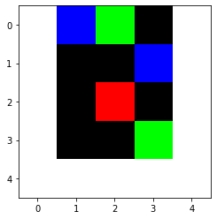

RLGridWorld
===========

This is a simple yet efficient, highly customizable grid-world implementation to run reinforcement learning algorithms.

The official documentation is here `https://rlgridworld.readthedocs.io/ <https://rlgridworld.readthedocs.io/>`_

Environment
-----------

You can simply use a string like 

.. code-block:: text

    W H T O W
    W O O H W
    W O A O W
    W O O T W
    W W W W W

to represent a grid-world, where

    * A: Agent
    * T: Target location
    * O: Empty Ground spot (where the agent can step on and stay)
    * W: Wall
    * H: Hole (where the agent will fall if it steps in)

The rgb_array rendering of which is:

The goal of the agent is to reach one of the Target locations without falling into a hole or falling out of the edge.
(More pre-configured environments can be found in EnvSettings)

Actions
-------

The actions can be continuous or discrete. The agent can also move diagonally.
The details can be found in the Action class in rlgridworld/gridenv.py

    * Continuous: Action is a tuple of length 2, where the first element is the x-axis and the second element is the y-axis
    * Discrete: Action can be chosen from ['UP', 'DOWN', 'RIGHT', 'LEFT', 'UPRIGHT', 'UPLEFT', 'DOWNRIGHT', 'DOWNLEFT']

Reward
------

Customizable with r_fall_off, r_reach_target, r_timeout, r_continue.
The details can be found in the __init__ function of class GridEnv in rlgridworld/gridenv.py
